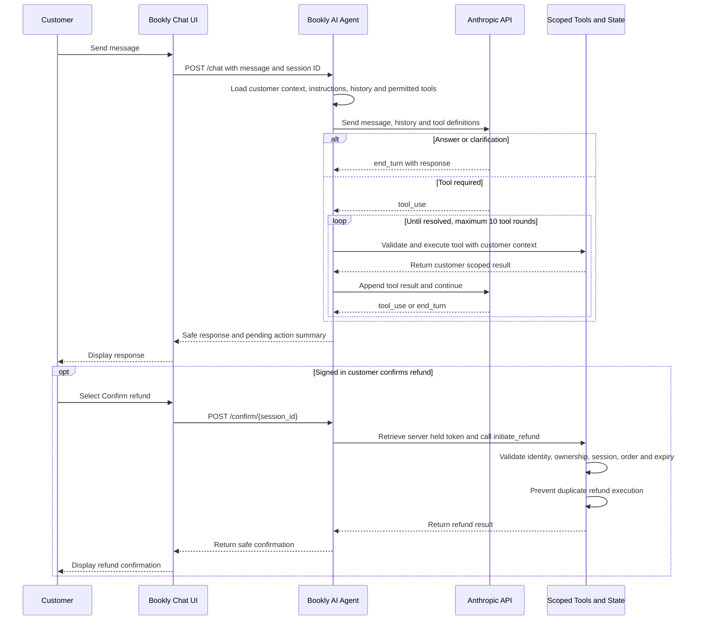

# Bookly AI Concierge

**Aria** is a conversational customer support agent for Bookly, a fictional online bookstore. It handles order tracking, refund preparation, and policy questions via natural language — in a browser chat UI and a command-line REPL.

> Built with **direct HTTP calls to the Anthropic Messages API** — no SDK, no agent framework.
> Every model interaction is a raw `requests.post()` to `api.anthropic.com/v1/messages`.

---

## Demonstration scope

Two journeys are supported: a guest customer tracking an order by ID and email, and Sarah Lee (an authenticated demo customer) reporting a damaged delivery, reviewing a prepared refund, and confirming it through the UI. All customer data is synthetic and held in memory.

---

### Request and action flow



The model can answer, clarify or request an available tool. Bookly injects customer context and validates every tool call. Refund execution follows a separate application controlled path and is never exposed to the model as a tool.

## Quick start

**CLI**
```bash
git clone https://github.com/ired2307/bookly-agent.git && cd bookly-agent
pip install -r requirements.txt
cp .env.example .env          # add ANTHROPIC_API_KEY
python cli.py
```

**Browser UI**
```bash
python -m uvicorn server:app --reload
# open http://127.0.0.1:8000
```

Select **Continue as guest** or **Sign in as Sarah Lee** in the left panel to switch demo context.

**Offline tests** (no API key required)
```bash
pytest -v
```

---

## Architecture

```
┌──────────────────────────────────────────────────────────┐
│  CHANNEL LAYER                                           │
│  Browser UI  (FastAPI + static HTML, session-per-tab)    │
│  CLI REPL    (single-session interactive terminal)       │
└────────────────────────┬─────────────────────────────────┘
                         │  user message
┌────────────────────────▼─────────────────────────────────┐
│  ORCHESTRATION LAYER                                     │
│  SupportAgent  — system prompt, tool dispatch, logging   │
│  ConversationClient  — raw HTTP agentic loop             │
│    POST /v1/messages                                     │
│      stop_reason == tool_use  → execute → append → POST  │
│      stop_reason == end_turn  → return text              │
│      stop_reason == max_tokens→ safe fallback            │
│      stop_reason == refusal   → surface safely           │
│  Multi-turn history · MAX_STEPS ceiling (10)             │
│  Bounded HTTP retries (MAX_HTTP_RETRIES=2, 1s/2s backoff)│
└────────────────────────┬─────────────────────────────────┘
                         │  tool calls (JSON schema — no ctx fields)
┌────────────────────────▼─────────────────────────────────┐
│  TOOL LAYER                                              │
│  lookup_order · prepare_refund · search_policies         │
│  escalate_to_human                                       │
│  initiate_refund  (application-only — not model-callable)│
│  Business rules enforced in Python — not in the prompt   │
│  ctx injected by orchestration layer, never by LLM       │
└────────────────────────┬─────────────────────────────────┘
                         │  reads / writes
┌────────────────────────▼─────────────────────────────────┐
│  DATA LAYER                                              │
│  ORDERS · POLICIES · CUSTOMERS                           │
│  REFUNDS_INITIATED · PENDING_REFUNDS                     │
└──────────────────────────────────────────────────────────┘
```

The model interprets intent and selects approved tools. Customer authority, policy validation, confirmation and transaction execution remain under application control.

---

## Key design decisions

### Direct Anthropic HTTP integration

There is no Anthropic SDK. Every request is:

```python
requests.post(
    "https://api.anthropic.com/v1/messages",
    headers={"x-api-key": ..., "anthropic-version": "2023-06-01"},
    json={"model": ..., "messages": history, "tools": tool_schemas, ...},
)
```

This keeps the dependency surface minimal and makes the loop transparent.

### Bounded tool loop (MAX_STEPS = 10)

The agentic loop has a hard ceiling: if the model has not produced a final `end_turn` response after 10 tool calls, the loop exits and returns a human-handoff message. This bounds execution time and prevents uncontrolled tool loops.

The HTTP retry budget is separate: up to `MAX_HTTP_RETRIES = 2` retries per API call on transient failures (429, 5xx, ConnectionError, Timeout), with 1 s / 2 s exponential backoff. Non-retryable errors (400, 401, 422) raise immediately without retry.

### Clarification before tool calls

The system prompt instructs Aria to ask for both order ID and email in a single focused question before calling `lookup_order`. The model does not call any tool until it has both pieces of information.

### Guest order matching (order ID + email)

`lookup_order` requires both an order ID and a matching email address. The same generic error is returned whether the order ID is unknown or the email does not match — this prevents callers from probing whether a given order ID exists.

### Server-controlled CustomerContext

Every tool function accepts a `CustomerContext` injected by the orchestration layer. The `ctx` fields (`session_id`, `authenticated`, `customer_id`) are absent from all tool schemas sent to the model — the model cannot forge or escalate authority.

`prepare_refund` rejects calls when `ctx.authenticated` is False. Order ownership is checked server-side against the `CUSTOMERS` map, not derived from anything the model supplies.

### Application-controlled confirmation

Refund preparation and refund execution are deliberately separated. The model can retrieve the order, evaluate eligibility and prepare the proposed refund, but it cannot confirm or execute the transaction.

1. `prepare_refund` validates customer authority, order ownership and refund eligibility.
2. The application stores a short-lived confirmation token in `PENDING_REFUNDS`.
3. The customer reviews the refund details and explicitly confirms through the interface.
4. The application calls `initiate_refund` using the server-held token.

The token is never exposed to the model or included in its tool schemas. This keeps customer consent and transaction authority under deterministic application control.

### Idempotent refund execution

A completed refund stores its result against the order. Repeated requests return the original result rather than executing the transaction again. This protects against duplicate refunds caused by retries or repeated confirmation.

### Tool and provider error handling

- All tool implementations are wrapped in `try/except`; exceptions return a safe JSON error with no stack traces or internal details.
- `execute_tool` validates tool names and required fields before dispatch.
- When a tool call raises in the client loop, the result block is sent back to the model with `is_error: true`.
- Errors from the Anthropic API are sanitised before raising — raw response bodies are not propagated.

---

## Endpoints

| Method | Path | Description |
|---|---|---|
| `GET` | `/` | Browser chat UI |
| `POST` | `/session` | Create a new session (returns `session_id`) |
| `POST` | `/chat` | Send a message (requires valid `session_id`) |
| `POST` | `/confirm/{session_id}` | Confirm pending refund (application-controlled) |
| `DELETE` | `/session/{session_id}` | Reset / end a session |

Clients must call `POST /session` before `POST /chat`. Arbitrary client-provided session IDs are not accepted.

---

## Test orders

| Order ID | Email | Status | Refund eligible | Customer |
|---|---|---|---|---|
| BK-10042 | jane.doe@email.com | Shipped | Yes | CUST-001 |
| BK-9871 | john.smith@email.com | Processing | No — cancel instead | CUST-002 |
| BK-8823 | alex.j@email.com | Delivered | No — outside 30-day window | CUST-003 |
| BK-10105 | sarah.lee@email.com | Delivered | Yes | CUST-004 |

---

## Tests

```bash
pytest -v            # all tests
pytest test_tools.py # tool + endpoint tests
pytest evals/        # trajectory evaluations
```

All tests run offline with no API key. The HTTP layer is mocked via `unittest.mock.patch("requests.post")`.

**Coverage:**
- Tool business logic (lookup, prepare, initiate, search, escalate)
- Enumeration prevention (identical errors for unknown order vs email mismatch)
- Guest/auth authority enforcement
- Confirmation token lifecycle (missing, expired, wrong session, consumed)
- Idempotent refund execution (returns original result on retry)
- Client loop: end_turn, tool_use, max_tokens, refusal, iteration limit
- Transient HTTP retry vs permanent failure vs retry limit
- Tool error bubbling with `is_error: true`
- FastAPI endpoint behaviour (session creation, auth mode, chat, confirm)
- Two trajectory evaluations with mocked responses

---

## File structure

```
bookly-agent/
├── agent.py            # SupportAgent — system prompt, tool dispatch
├── client.py           # ConversationClient — raw HTTP + agentic loop
├── context.py          # CustomerContext dataclass
├── tools.py            # Tool schemas (sent to model) + implementations
├── data.py             # Synthetic orders, policies, customers, in-memory logs
├── config.py           # Settings loaded from .env
├── server.py           # FastAPI server — /session, /chat, /confirm, static UI
├── cli.py              # Interactive REPL
├── test_tools.py       # Offline unit + endpoint tests
├── test_scenarios.py   # Manual demo script
├── conftest.py         # pytest path setup + state-reset fixture
├── evals/
│   ├── __init__.py
│   └── test_journeys.py  # Trajectory evaluations
├── pyproject.toml      # ruff + pytest config
├── requirements.txt
└── static/
    └── index.html      # Browser chat UI
```

---

## Prototype limitations

| Limitation | Production consideration |
|---|---|
| **In-memory sessions** | Session history is lost on restart — production requires a durable store |
| **In-memory data** | `ORDERS`, `REFUNDS_INITIATED`, `PENDING_REFUNDS` are Python dicts — production requires persistent storage with ACID guarantees |
| **Demo authentication** | `CustomerContext` is set server-side from a mode parameter — production would derive it from a verified session token |
| **Single-process** | Session dicts are not shared across workers — production requires a distributed session store |
| **No token expiry sweep** | Expired `PENDING_REFUNDS` entries accumulate in memory — production would use a TTL store or background sweep |

## Production extension points

- Replace the demo mode parameter in `create_session` with JWT or session token validation.
- Replace `ORDERS` with a database query; replace `REFUNDS_INITIATED` and `PENDING_REFUNDS` with transactional DB rows.
- Add structured logging (token counts, latencies, tool call outcomes) for observability.
- Add an evaluation pipeline: deterministic tool-call graders and LLM-as-judge scoring on every prompt or model change.
- Add circuit-breaker logic around `_post` for graceful degradation under sustained API failures.
